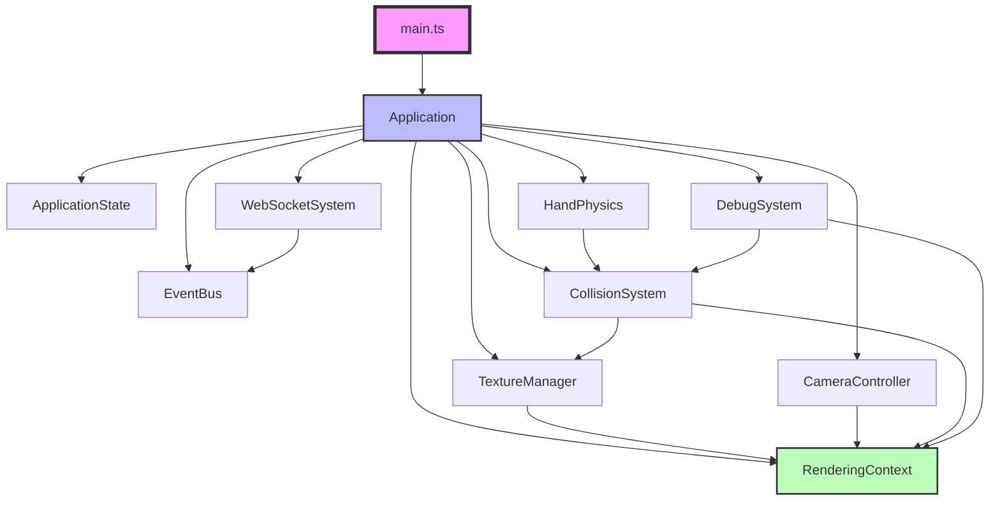

# Frontend Refactoring Design Document

## 📅 작성일: 2025-10-27

---

## 🎯 목표

현재 1947줄의 모놀리식 main.ts를 100줄로 축소하고, 모듈화된 구조로 전환하여 VR/AR 충돌 시스템을 효율적으로 통합할 수 있는 기반 마련

---

## 📋 Frontend 필수 기능 목록

### 1. Core Systems (핵심 시스템)

#### 1.1 WebSocket Communication

- **현재**: 전역 변수와 직접 조작
- **목표**: 캡슐화된 통신 시스템
- **기능**:
  - Camera frame 전송 (160 bytes)
  - Video frame 수신 (44 bytes header + data)
  - 자동 재연결
  - Connection state 관리
  - Binary protocol 처리

#### 1.2 Rendering Pipeline

- **현재**: Three.js 렌더링 코드 산재
- **목표**: 중앙화된 렌더링 컨텍스트
- **기능**:
  - Scene 초기화 및 관리
  - Mesh/Point cloud 렌더링
  - Texture 업데이트 (Color + Depth)
  - Camera 제어
  - Post-processing effects

#### 1.3 Texture Management

- **현재**: wsColorTexture, wsDepthTexture 전역 변수
- **목표**: TextureManager 통한 중앙 관리
- **기능**:
  - JPEG+Depth 디코딩
  - H.264 비디오 디코딩
  - Texture 생성/업데이트
  - Memory 관리
  - Format 자동 감지

#### 1.4 Camera Control

- **현재**: OrbitControls + custom logic 혼재
- **목표**: 확장 가능한 카메라 시스템
- **기능**:
  - Orbit control (마우스/터치)
  - First-person view
  - Third-person view

### 2. Physics & Collision (물리 및 충돌)

#### 2.1 Collision Detection

- **신규**: Depth map 기반 충돌 감지
- **기능**:
  - World-to-screen projection
  - Depth sampling at position
  - Collision response
  - Multiple collision points
  - Dynamic object support

#### 2.2 Hand/Controller Physics

- **신규**: VR/AR 입력 처리
- **기능**:
  - Hand/Controller tracking
  - Velocity calculation
  - Predictive compensation (80ms)
  - Smoothing/Filtering
  - Grab/Release mechanics

### 3. UI & Debug Systems

#### 3.1 UI Management

- **현재**: HTML 직접 조작
- **목표**: React 스타일 상태 관리
- **기능**:
  - Stats display (FPS, latency)
  - Control panels
  - Settings management
  - Mode switching
  - Debug overlays

#### 3.2 Debug System

- **현재**: console.log 산재
- **목표**: 구조화된 디버깅 시스템
- **기능**:
  - Performance monitoring
  - Network latency tracking
  - Collision visualization
  - Depth map overlay
  - Recording/Playback

### 4. State Management

#### 4.1 Application State

- **현재**: 전역 변수 122개
- **목표**: 중앙화된 상태 관리
- **기능**:
  - Connection state
  - Rendering state
  - Camera state
  - Physics state
  - UI state

#### 4.2 Event System

- **신규**: 비동기 이벤트 버스
- **기능**:
  - Event registration
  - Event dispatch
  - Priority handling
  - Event filtering
  - Lifecycle hooks

---

## 🏗️ 클래스 설계

### Core Layer

```typescript
// Application.ts - 메인 애플리케이션 클래스
class Application {
  private renderingContext: RenderingContext;
  private systems: Map<string, System>;
  private eventBus: EventBus;
  private state: ApplicationState;

  constructor(config: ApplicationConfig) {}

  async initialize(): Promise<void> {
    // 시스템 초기화 순서
    // 1. Create rendering context
    // 2. Initialize systems
    // 3. Setup event listeners
    // 4. Start render loop
  }

  registerSystem(name: string, system: System): void {}
  getSystem<T extends System>(name: string): T {}

  private update(deltaTime: number): void {}
  private render(): void {}
  private handleResize(): void {}
}

// RenderingContext.ts - 렌더링 상태 캡슐화
class RenderingContext {
  readonly scene: THREE.Scene;
  readonly camera: THREE.PerspectiveCamera;
  readonly renderer: THREE.WebGLRenderer;
  readonly canvas: HTMLCanvasElement;

  private meshes: Map<string, THREE.Mesh>;
  private textures: Map<string, THREE.Texture>;

  constructor(canvas: HTMLCanvasElement, config: RenderConfig) {}

  addMesh(id: string, mesh: THREE.Mesh): void {}
  removeMesh(id: string): void {}
  getMesh(id: string): THREE.Mesh | undefined {}

  setTexture(id: string, texture: THREE.Texture): void {}
  getTexture(id: string): THREE.Texture | undefined {}

  resize(width: number, height: number): void {}
  clear(): void {}
}
```

### System Layer

```typescript
// Base System Interface
interface System {
  name: string;
  initialize(context: SystemContext): Promise<void>;
  update(deltaTime: number): void;
  dispose(): void;
}

// WebSocketSystem.ts
class WebSocketSystem implements System {
  name = "websocket";

  private socket: WebSocket | null = null;
  private reconnectTimer: number | null = null;
  private messageQueue: Uint8Array[] = [];

  async connect(url: string): Promise<void> {}
  disconnect(): void {}

  sendCameraFrame(frame: CameraFrame): void {}
  onVideoFrame(callback: VideoFrameCallback): void {}

  private handleMessage(data: ArrayBuffer): void {}
  private handleReconnect(): void {}
  private processMessageQueue(): void {}
}

// TextureManager.ts
class TextureManager implements System {
  name = "texture";

  private colorTexture: THREE.Texture;
  private depthTexture: THREE.Texture;
  private videoDecoder: VideoDecoder | null = null;

  async updateFromJPEG(
    jpegData: Uint8Array,
    depthData: Float32Array
  ): Promise<void> {}
  async updateFromH264(videoData: Uint8Array): Promise<void> {}
  async updateFromRaw(rawData: ArrayBuffer): Promise<void> {}

  getColorTexture(): THREE.Texture {}
  getDepthTexture(): THREE.Texture {}

  private createTexture(width: number, height: number): THREE.Texture {}
  private disposeTexture(texture: THREE.Texture): void {}
}

// CameraController.ts
class CameraController implements System {
  name = "camera";

  private camera: THREE.PerspectiveCamera;
  private controls: OrbitControls | null = null;
  private mode: CameraMode = CameraMode.Orbit;

  setMode(mode: CameraMode): void {}
  setPosition(position: THREE.Vector3): void {}
  setTarget(target: THREE.Vector3): void {}

  getViewMatrix(): Float32Array {}
  getProjectionMatrix(): Float32Array {}
  getCameraFrame(): CameraFrame {}

  enableControls(enabled: boolean): void {}
  smoothTransition(to: CameraState, duration: number): void {}
}
```

### Physics Layer

```typescript
// CollisionSystem.ts
class CollisionSystem implements System {
  name = "collision";

  private depthTexture: THREE.Texture | null = null;
  private renderingContext: RenderingContext;
  private collisionPoints: CollisionPoint[] = [];

  setDepthTexture(texture: THREE.Texture): void {}

  checkCollision(worldPosition: THREE.Vector3): CollisionResult {
    // 1. World to NDC projection
    // 2. Sample depth at position
    // 3. Compare with projected depth
    // 4. Return collision info
  }

  checkMultiplePoints(points: THREE.Vector3[]): CollisionResult[] {}

  private worldToScreen(position: THREE.Vector3): THREE.Vector2 {}
  private sampleDepth(uv: THREE.Vector2): number {}
  private calculateNormal(uv: THREE.Vector2): THREE.Vector3 {}
}

// HandPhysics.ts
class HandPhysics implements System {
  name = "handPhysics";

  private leftHand: HandState;
  private rightHand: HandState;
  private collisionSystem: CollisionSystem;

  updateHandPosition(hand: HandType, position: THREE.Vector3): void {}
  updateHandVelocity(hand: HandType, velocity: THREE.Vector3): void {}

  applyPhysics(deltaTime: number): void {
    // 1. Predict position (latency compensation)
    // 2. Check collision
    // 3. Apply response
    // 4. Update velocity
  }

  private predictPosition(
    position: THREE.Vector3,
    velocity: THREE.Vector3
  ): THREE.Vector3 {}
  private applyCollisionResponse(collision: CollisionResult): void {}
  private smoothPosition(
    current: THREE.Vector3,
    target: THREE.Vector3
  ): THREE.Vector3 {}
}
```

### State Management

```typescript
// ApplicationState.ts
class ApplicationState {
  private state: Map<string, any> = new Map();
  private listeners: Map<string, Set<StateListener>> = new Map();

  get<T>(key: string): T | undefined {}
  set<T>(key: string, value: T): void {}

  subscribe(key: string, listener: StateListener): () => void {}
  unsubscribe(key: string, listener: StateListener): void {}

  private notifyListeners(key: string, value: any): void {}
}

// EventBus.ts
class EventBus {
  private events: Map<string, Set<EventHandler>> = new Map();
  private eventQueue: Event[] = [];
  private processing = false;

  on(event: string, handler: EventHandler): void {}
  off(event: string, handler: EventHandler): void {}
  once(event: string, handler: EventHandler): void {}

  emit(event: string, data?: any): void {}
  emitAsync(event: string, data?: any): Promise<void> {}

  private processQueue(): void {}
}
```

### Debug Layer

```typescript
// DebugSystem.ts
class DebugSystem implements System {
  name = "debug";

  private stats: Stats;
  private debugOverlay: DebugOverlay;
  private performanceMonitor: PerformanceMonitor;

  showStats(visible: boolean): void {}
  showDepthMap(visible: boolean): void {}
  showCollisionPoints(visible: boolean): void {}

  logPerformance(metric: string, value: number): void {}
  trackLatency(type: LatencyType, value: number): void {}
}

// CollisionDebugger.ts
class CollisionDebugger {
  private spheres: THREE.Mesh[] = [];
  private lines: THREE.Line[] = [];

  visualizeCollisionPoint(point: CollisionPoint): void {}
  visualizeNormal(position: THREE.Vector3, normal: THREE.Vector3): void {}
  visualizeDepthMap(depthTexture: THREE.Texture): void {}

  clear(): void {}
}
```

---

## 📐 인터페이스 정의

```typescript
// Core Interfaces
interface ApplicationConfig {
  canvas: HTMLCanvasElement;
  wsUrl: string;
  width: number;
  height: number;
  renderMode: RenderMode;
  debugMode: boolean;
}

interface SystemContext {
  renderingContext: RenderingContext;
  eventBus: EventBus;
  state: ApplicationState;
}

// Data Types
interface CameraFrame {
  eye: Float32Array; // 3 floats
  target: Float32Array; // 3 floats
  intrinsics: Float32Array; // 9 floats
  frameId: number;
  timestamp: number;
  timeIndex: number;
}

interface VideoFrame {
  frameId: number;
  formatType: FormatType; // 0=JPEG, 1=H264, 2=Raw
  colorData: Uint8Array;
  depthData?: Float32Array;
  width: number;
  height: number;
  timestamps: {
    client: number;
    server: number;
    renderStart: number;
    encodeEnd: number;
  };
}

// Physics Interfaces
interface CollisionPoint {
  position: THREE.Vector3;
  normal: THREE.Vector3;
  depth: number;
  screenPosition: THREE.Vector2;
}

interface CollisionResult {
  hit: boolean;
  point?: CollisionPoint;
  distance?: number;
  object?: string;
}

interface HandState {
  position: THREE.Vector3;
  velocity: THREE.Vector3;
  rotation: THREE.Quaternion;
  isGrabbing: boolean;
  grabbedObject?: string;
}

// Enums
enum RenderMode {
  Mesh = "mesh",
  PointCloud = "pointcloud",
  Hybrid = "hybrid",
}

enum CameraMode {
  Orbit = "orbit",
  FirstPerson = "firstperson",
  ThirdPerson = "thirdperson",
  VR = "vr",
  AR = "ar",
}

enum FormatType {
  JPEG = 0,
  H264 = 1,
  Raw = 2,
}

enum HandType {
  Left = "left",
  Right = "right",
}
```

---

## 🔀 의존성 관계



---

## 📝 구현 순서 (14 Checkpoints)

### Phase 1: Non-Breaking Preparation (CP 1-5)

#### CP1: Type Definitions

```typescript
// frontend/src/types/index.ts
export interface CameraFrame { ... }
export interface VideoFrame { ... }
export interface CollisionResult { ... }
export enum RenderMode { ... }
```

#### CP2: RenderingContext (Read-only wrapper)

```typescript
// frontend/src/core/RenderingContext.ts
// Wrap existing THREE.js objects without modifying them
class RenderingContext {
  constructor(
    scene: THREE.Scene,
    camera: THREE.Camera,
    renderer: THREE.Renderer
  ) {
    // Store references only
  }
}
```

#### CP3: System Classes (No integration)

```typescript
// Create all system classes but don't connect them
// They exist alongside old code
```

#### CP4: Parallel Initialization

```typescript
// main.ts
const app = new Application(config); // New
// Old initialization code remains
```

#### CP5: Verification

```typescript
// Run both systems in parallel
// Compare outputs
// Ensure identical behavior
```

### Phase 2: Gradual Migration (CP 6-9)

#### CP6: WebSocket Migration

```typescript
// Replace global websocket with WebSocketSystem
// Feature flag: USE_NEW_WEBSOCKET
```

#### CP7: Texture Migration

```typescript
// Replace wsColorTexture/wsDepthTexture with TextureManager
// Feature flag: USE_NEW_TEXTURE_MANAGER
```

#### CP8: Render Loop Migration

```typescript
// Move render loop to Application
// Remove old animation loop
```

#### CP9: Legacy Cleanup ⚠️

```typescript
// Remove all global variables
// Remove old initialization code
// Point of no return!
```

### Phase 3: Collision System (CP 10-14)

#### CP10: CollisionSystem Implementation

```typescript
// Implement depth-based collision
// Test with static points
```

#### CP11: Integration (Disabled)

```typescript
// Connect to Application
// Feature flag: ENABLE_COLLISION = false
```

#### CP12: Debug Visualization

```typescript
// Add collision debug overlay
// Performance metrics
```

#### CP13: Enable by Default

```typescript
// ENABLE_COLLISION = true
// Monitor performance
```

#### CP14: VR/AR Support

```typescript
// Add hand tracking
// Controller support
// Predictive compensation
```

---

## 🎯 Success Metrics

### Code Quality

- main.ts: 1947 → 100 lines
- Global variables: 122 → 0
- Test coverage: 0% → 80%
- Type safety: Partial → Full

### Performance

- Collision check: < 1ms/frame
- Memory overhead: < 10MB
- FPS: Maintain 60 FPS
- Latency compensation: 80ms

### Features

- ✅ Modular architecture
- ✅ Depth-based collision
- ✅ VR/AR ready
- ✅ Debug tools
- ✅ Extensible systems

---

## 🚧 Risk Mitigation

### Risk 1: Breaking Changes

- **Mitigation**: Feature flags for gradual migration
- **Rollback**: Git tags at each checkpoint

### Risk 2: Performance Regression

- **Mitigation**: Parallel system comparison (CP4-5)
- **Monitoring**: Performance metrics at each step

### Risk 3: WebGL Context Loss

- **Mitigation**: Proper cleanup in dispose() methods
- **Recovery**: Automatic context restoration

### Risk 4: Memory Leaks

- **Mitigation**: Explicit dispose() for all resources
- **Testing**: Memory profiling at each checkpoint

---

## 📚 참고사항

### Backend 패턴 적용

- Factory Pattern: System registration
- Dependency Injection: Constructor parameters
- Interface Segregation: Minimal interfaces
- Single Responsibility: One system, one purpose

### Frontend 특화 패턴

- Event Bus: Decoupled communication
- State Management: Centralized state
- Observer Pattern: Reactive updates
- Command Pattern: User interactions

### Testing Strategy

```typescript
// Unit tests for each system
describe("CollisionSystem", () => {
  it("should detect collision with depth map", () => {});
  it("should handle edge cases", () => {});
});

// Integration tests
describe("Application", () => {
  it("should initialize all systems", () => {});
  it("should handle system failures", () => {});
});
```

---

## 🎉 예상 결과

### Day 1 완료 시

- 기본 구조 완성
- 충돌 시스템 MVP
- main.ts 100줄

### Day 2 완료 시

- 전체 통합 완료
- Dynamic Gaussian 지원
- Debug 도구 완성

### Day 3 완료 시

- VR/AR 지원
- 성능 최적화
- 문서화 완료

---

**작성자**: Claude
**날짜**: 2025-10-27
**상태**: 설계 완료, 구현 준비
