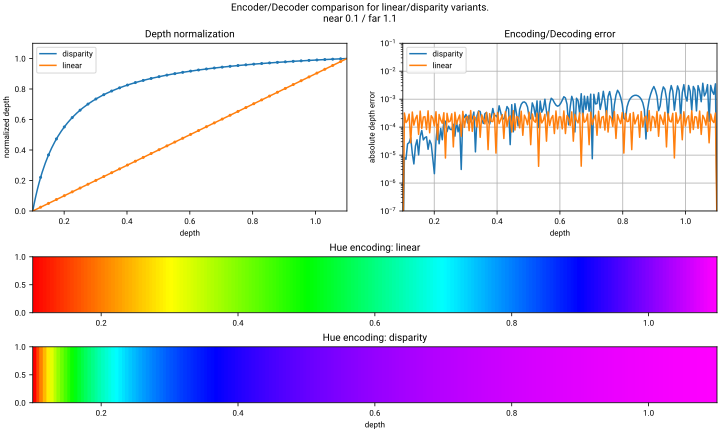

[](https://doi.org/10.5281/zenodo.14014715)

# hue-depth-encoding
This project provides efficient vectorized Python code to perform depth `<->` color encoding based on

> Sonoda, Tetsuri, and Anders Grunnet-Jepsen.
"Depth image compression by colorization for Intel RealSense depth cameras." Intel, Rev 1.0 (2021).

with the following significant changes:
 1. We stop the hue range at 300° (default) in order to avoid having close and far ranges assigned redish color.
 1. We detect de-valued and de-saturized colors in the decoding and assign it a pre-defined failure depth.

The encoding is designed to transform 16bit single channel images to RGB color images that can be processed by standard (lossy) image codec with *minimized* compression artefacts. This leads to a compression factor of up to 80x while maintaining acceptable depth accuracy for many RGBD systems.

## Method

The underlying method is described in 

> Sonoda, Tetsuri, and Anders Grunnet-Jepsen.
"Depth image compression by colorization for Intel RealSense depth cameras." Intel, Rev 1.0 (2021).

However, the formulae presented appear to be inaccurate and specific important details seem to be left out. Here we describe the base encoding plus our adaptations.

The base method relies on encoding depth as fully saturated/valued colors and assigns increasing depth values increasing hues. For bitdepth $b$ this allows for

```math
n = \lfloor \textrm{Hue}_{\textrm{max}}/ 60\rfloor (2^b - 1) + 1
```
unique colors. In the original method $`\textrm{Hue}_{\textrm{max}}=360°`$, whereas in this implementation $`\textrm{Hue}_{\textrm{max}}=300°`$ to avoid ambiguitis between close and far depth values that would otherwise get assigned a reddish color.

Limiting $`\textrm{Hue}_{\textrm{max}}`$ limits the number of available bits to $`\log_2 n`$ (~10.3bit).


### Depth transformations
The encoding allows for linear and disparity depth normalization. In linear mode, equal depth ratios are preserved in the encoding range, whereas in disparity mode more emphasis is put on closer depth values than on larger ones, leading to more accurare depth resolution closeup.




## Implementation

This implementation is vectorized using numpy and can handle any image shapes `(*,H,W) <-> (*,H,W,3)`. For improved performance, we precompute encoder and decoder lookup tables to reduce encoding/decoding to a simple lookup. The lookup tables require ~32MB of memory. Use `use_lut=False` switch to rely on the pure vectorized implementation. See benchmarks below for effects.

## Installation
With Python >= 3.11 execute

```shell
git clone https://github.com/cheind/hue-depth-encoding.git
pip install -e .

# or development install adds more packages to run tests/analysis
pip install -e '.[dev]'
# or with gpu codec support in dev mode
pip install -e '.[dev]' --no-binary=av 
```

## Usage

Basic usage

```python
# Import
import huecodec as hc

# Random float depths
d = rng.random((5,240,320), dtype=np.float32)*0.9 + 0.1

# Encode
rgb = hc.depth2rgb(d, zrange=(0.1,1.0), inv_depth=False)
# (5,240,320,3), uint8

# Decode
depth = hc.rgb2depth(rgb, zrange=(0.1,1.0), inv_depth=False)
# (5,240,320), float32
```

## Evaluation

### Encoding/Decoding Roundtrips

The script `python analysis.py` compares encoding and decoding characteristics for different standard video codecs using hue depth encoding. The reported figures have the following meaning:

 - **rmse** [m] root mean square error per depth pixel between groundtruth and transcoded depthmaps
 - **<x** [%] percent of absolute errors less than x
 - **failed** [%] percent of reconstructions failed during decoding. This appear when using lossy video codecs and rgb values are de-saturated or de-valued too much by the codec.
 - **tenc** [milli-sec/frame] encoding time per frame
 - **tdec** [milli-sec/frame] decoding time per frame
 - **nbytes** [kb/frame] kilo-bytes per encoded frame on disk.


All tests are carried out on a 12th Gen Intel® Core™ i9-12900K × 24 with NVIDIA GeForce RTX™ 3090 Ti.

```shell
# run analysis only for specific variants
python analysis.py variant=[hue-only,h264-lossless-gpu]
```

#### Synthetic Depthmaps

Each test encodes/decodes a sequence `(100,512,512)` of np.float32 depthmaps in range `[0..2]` containing a sinusoidal pattern plus random hard depth edges. The pattern moves horizontally over time.


The reported values are
| variant           | zrange [m]   |   rmse [m] |   <1mm [%] |   <5mm [%] |   <1cm [%] |   failed [%] |   tenc [ms/img] |   tdec [ms/img] |   size [kb/img] |
|:------------------|:-------------|-----------:|-----------:|-----------:|-----------:|-------------:|----------------:|----------------:|----------------:|
| hue-only          | (0.0, 2.0)   |    0.00040 |      1.000 |      1.000 |      1.000 |        0.000 |            1.98 |            1.32 |          768.00 |
| hue-only          | (0.0, 4.0)   |    0.00080 |      0.718 |      1.000 |      1.000 |        0.000 |            1.85 |            1.34 |          768.00 |
| h264-lossless-cpu | (0.0, 2.0)   |    0.00040 |      0.999 |      1.000 |      1.000 |        0.000 |            5.55 |            2.99 |           30.99 |
| h264-lossless-cpu | (0.0, 4.0)   |    0.00080 |      0.718 |      1.000 |      1.000 |        0.000 |            5.60 |            2.75 |           25.46 |
| h264-default-cpu  | (0.0, 2.0)   |    0.03587 |      0.287 |      0.508 |      0.707 |        0.004 |            4.93 |            1.89 |           10.26 |
| h264-default-cpu  | (0.0, 4.0)   |    0.03755 |      0.279 |      0.496 |      0.694 |        0.001 |            4.65 |            1.78 |            9.44 |
| h264-lossless-gpu | (0.0, 2.0)   |    0.00040 |      1.000 |      1.000 |      1.000 |        0.000 |            2.60 |            2.07 |           48.19 |
| h264-lossless-gpu | (0.0, 4.0)   |    0.00080 |      0.718 |      1.000 |      1.000 |        0.000 |            2.59 |            1.95 |           25.63 |
| h264-tuned-gpu    | (0.0, 2.0)   |    0.00078 |      0.838 |      0.997 |      0.997 |        0.003 |            2.60 |            2.09 |           23.38 |
| h264-tuned-gpu    | (0.0, 4.0)   |    0.00138 |      0.616 |      0.996 |      0.999 |        0.001 |            2.84 |            1.98 |           13.34 |
| h265-lossless-gpu | (0.0, 2.0)   |    0.00040 |      1.000 |      1.000 |      1.000 |        0.000 |            2.60 |            2.82 |           30.15 |
| h265-lossless-gpu | (0.0, 4.0)   |    0.00080 |      0.718 |      1.000 |      1.000 |        0.000 |            2.59 |            2.73 |           25.59 |
| h264-default-gpu  | (0.0, 2.0)   |    0.03591 |      0.285 |      0.506 |      0.706 |        0.005 |            2.59 |            2.63 |           16.70 |
| h264-default-gpu  | (0.0, 4.0)   |    0.03762 |      0.276 |      0.491 |      0.690 |        0.001 |            2.58 |            2.27 |           12.50 |

#### Real Depthmaps

Each tests encodes a sequence of `(30,600,800)` of np.float32 depthmaps taken with a RealSense 415 in range `[0..2]` containing a sitting person moving.


The reported values are

| variant           | zrange [m]   |   rmse [m] |   <1mm [%] |   <5mm [%] |   <1cm [%] |   failed [%] |   tenc [ms/img] |   tdec [ms/img] |   size [kb/img] |
|:------------------|:-------------|-----------:|-----------:|-----------:|-----------:|-------------:|----------------:|----------------:|----------------:|
| hue-only          | (0.0, 2.0)   |    0.00028 |      1.000 |      1.000 |      1.000 |        0.000 |            2.03 |            1.27 |          900.00 |
| hue-only          | (0.0, 4.0)   |    0.00057 |      0.857 |      1.000 |      1.000 |        0.000 |            2.03 |            1.27 |          900.00 |
| h264-lossless-cpu | (0.0, 2.0)   |    0.00028 |      1.000 |      1.000 |      1.000 |        0.000 |           10.13 |            4.08 |           83.76 |
| h264-lossless-cpu | (0.0, 4.0)   |    0.00057 |      0.857 |      1.000 |      1.000 |        0.000 |            9.44 |            3.57 |           62.30 |
| h264-default-cpu  | (0.0, 2.0)   |    0.04110 |      0.738 |      0.949 |      0.959 |        0.026 |            9.44 |            2.67 |           42.16 |
| h264-default-cpu  | (0.0, 4.0)   |    0.09251 |      0.682 |      0.916 |      0.955 |        0.005 |            7.68 |            2.51 |           36.18 |
| h264-lossless-gpu | (0.0, 2.0)   |    0.00028 |      1.000 |      1.000 |      1.000 |        0.000 |            2.86 |            2.74 |          102.48 |
| h264-lossless-gpu | (0.0, 4.0)   |    0.00057 |      0.857 |      1.000 |      1.000 |        0.000 |            2.84 |            2.57 |           73.91 |
| h264-tuned-gpu    | (0.0, 2.0)   |    0.00104 |      0.825 |      0.974 |      0.976 |        0.024 |            2.84 |            2.45 |           62.26 |
| h264-tuned-gpu    | (0.0, 4.0)   |    0.00276 |      0.724 |      0.963 |      0.985 |        0.012 |            2.86 |            2.33 |           45.74 |
| h265-lossless-gpu | (0.0, 2.0)   |    0.00028 |      1.000 |      1.000 |      1.000 |        0.000 |            2.85 |            5.30 |           89.73 |
| h265-lossless-gpu | (0.0, 4.0)   |    0.00057 |      0.857 |      1.000 |      1.000 |        0.000 |            2.85 |            4.81 |           66.92 |
| h264-default-gpu  | (0.0, 2.0)   |    0.04110 |      0.726 |      0.944 |      0.958 |        0.027 |            2.82 |            3.79 |           33.68 |
| h264-default-gpu  | (0.0, 4.0)   |    0.09264 |      0.676 |      0.901 |      0.952 |        0.005 |            2.83 |            3.76 |           32.44 |

```
python analysis.py data=path/to/npy
```

### Hue Runtime Benchmark

Here are benchmark results for encoding/decoding float32 depthmaps of various sizes with differnt characteristics. Note, this is pure depth -> color -> depth transcoding without any video codecs involved.

```
------------- benchmark: 8 tests ------------
Name (time in ms)              Mean          
---------------------------------------------
enc_perf[LUT-(640x480)]        2.1851 (1.0)    
dec_perf[LUT-(640x480)]        2.2124 (1.01)   
enc_perf[LUT-(1920x1080)]     17.9139 (8.20) 
dec_perf[LUT-(1920x1080)]     16.4741 (7.54)   
enc_perf[noLUT-(640x480)]     22.3938 (10.25)  
dec_perf[noLUT-(640x480)]      6.9320 (3.17)   
dec_perf[noLUT-(1920x1080)]   74.6038 (34.14)  
enc_perf[noLUT-(1920x1080)]  158.0871 (72.35)  
---------------------------------------------
```

```shell
# run tests and benchmarks  
pytest
```

### Note on Video Codecs

When tuning the prameters for a video codec you need to take into account lossy compression that happens on  different levels of encoding:
 - **spatial/temporal** quantization based how images change over time. Usually controlled by the codec `preset/profile` (lossless, low-latency,...) and quality parameters such as `crf`, `qp`.
 - **color space** quantization due to converting RGB to target pixel format. Different codecs support different pixel color formats of which most perform a lossy compression from rgb to target space. 

Print encoder supported options and pixel formats
```shell
# print encoder options
ffmpeg -h encoder=h264_nvenc
```

See packing and compression of color formats
https://github.com/FFmpeg/FFmpeg/blob/master/libavutil/pixfmt.h


### Takeaways
Here are some take aways to consider
 - adjust zrange as tightly as possible to your use-case. This increases filesize but reduces reconstruction loss.
 - prefer loss-less codecs if affordable
 - when using lossy codecs ensure that your application does not rely on depth-edges.

The following plot shows a lossy h264 encoding on real data. Most of the errors are sub-mm, only few > 1cm. 


Turns out these errors are located on depth edges where the lossy codec starts interpolating values.
 

## Notes

The original paper referenced is potentially inaccurate in its equations. This has been noted in varios posts [#10415](https://github.com/IntelRealSense/librealsense/issues/10145),[#11187](https://github.com/IntelRealSense/librealsense/issues/11187),[#10302](https://github.com/IntelRealSense/librealsense/issues/10302).

This implementation is based on the original paper and code from
https://github.com/jdtremaine/hue-codec/.
